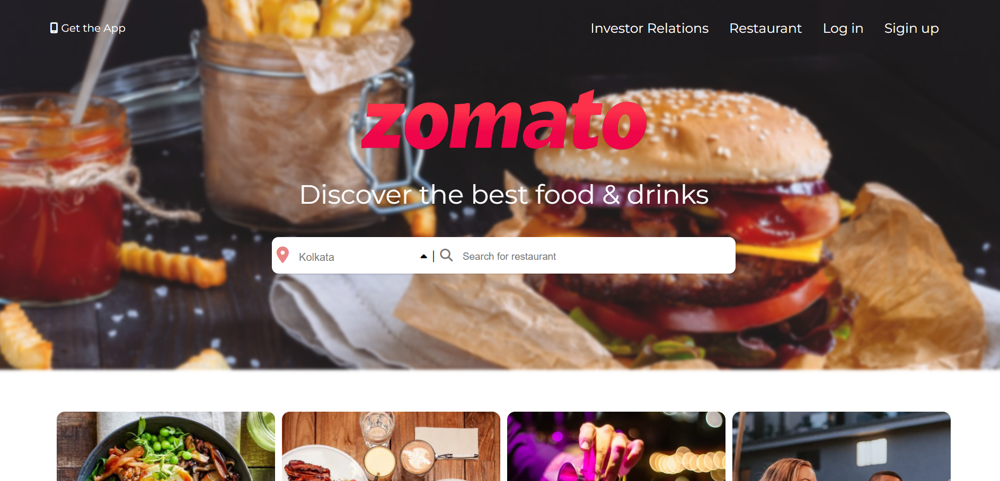

    

As a beginner, website clone is a good way to learn and practice the basics. So I tried to clone Zomato website home page using HTML & CSS. Key learnings include:

* #### Flexbox :
Flexbox is used to structure the elements in different ways as we want. I have used it to create navigation, to align the main content in center and in other parts. Flexbox is really what it's name i.e flexible. I learned flexbox from Traversy Media youtube and online from css tricks website which is an excellent guide.

* #### Grid :
Grid is used to structure the outer parts of a section. I have used grid in structuring the elements like collections images, localities and footer. I learned css grid from Traversy Media youtube.

* #### Absoulte Positioning :
I have used absolute positioning css, for order category images. In the beginning it feels little tricky but with practice we get clear understanding of it.

* #### Hover Animations :
Animation is the key element to have a great website. It adds a good experience while hovering any element.

## Built With

If you are a beginner and just started with html & css, learn the basics and start building simple website which will help you in getting the idea of how all the elements works together and it feels great after getting things done.

## Authors

* **Rupnath Shaw** - *Comp Sci Student* - [Rupnath Shaw](https://github.com/iamrupnath) 

